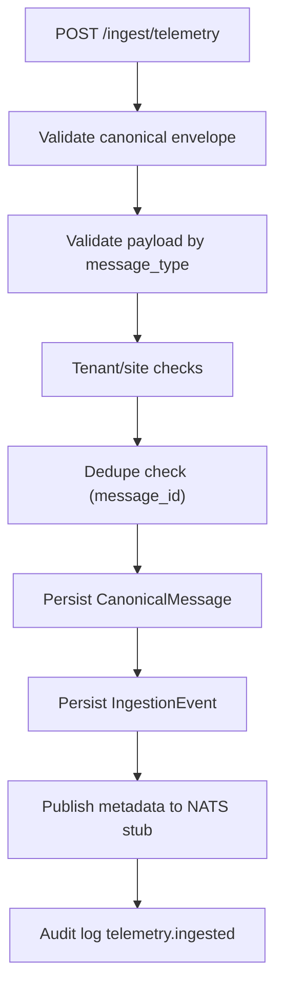

# Realtime, Ingestion, and Alerting

## Live Channels
Server emits tenant-scoped Socket.IO channels:
- `robots.live`
- `incidents.live`
- `missions.live`
- `telemetry.live`
- `alerts.live`
- `live.heartbeat` (heartbeat/meta)

Gateway implementation: `apps/api/src/realtime/live.gateway.ts`

Connection behavior:
1. Client provides JWT in `handshake.auth.token` (or Bearer header fallback).
2. Server verifies token using `JWT_SECRET`.
3. Socket joins `tenant:{tenantId}` room.
4. Client may subscribe to channel rooms via `live.subscribe`.

## Canonical Ingestion Pipeline
Primary endpoint: `POST /api/ingest/telemetry` in `Phase3Service.ingestTelemetry`.

### Accepted Message Contract
- Strict canonical envelope only.
- `schema_version` support currently restricted to `1`.
- `message_type` restricted to:
  - `robot_state`
  - `robot_event`
  - `task_status`

### Ingest Flow

### Dedupe/Idempotency
Duplicate detection checks both:
- `IngestionEvent(tenantId,dedupeKey=message_id)`
- `CanonicalMessage(tenantId,messageId)`

Duplicate response returns `accepted:0, duplicate:1`.

## Queue Abstraction and Consumer Tick
Service: `apps/api/src/services/nats-jetstream.service.ts`

Current behavior:
- In-memory queue abstraction storing published messages.
- Connectivity probe to `NATS_URL` host/port every 10s.
- Status surfaced via `/system/pipeline-status`.

Consumer loop: `processIngestionTick()` in `Phase3Service`:
1. Pull up to 200 messages from configured telemetry subject.
2. Extract ingestion event IDs.
3. If bus is empty, fallback to queued/published DB events.
4. Process each event via `processIngestionEvent()`.

## Consumer Routing by `message_type`
- `robot_state`
  - Updates robot status/pose/telemetry fields.
  - Appends telemetry points from `payload.metrics`.
  - Emits `telemetry.live`.
  - Does not create incidents.
- `robot_event`
  - Creates incident and incident timeline event when `create_incident=true`.
  - Emits `incidents.live`.
- `task_status`
  - Updates mission lifecycle fields/timestamps/duration.
  - Appends mission timeline event.
  - Emits `missions.live`.

Failure path:
- Marks ingestion event `failed`.
- Persists payload/error in `TelemetryDeadLetter`.

## Alerting Engine (Phase 3)
Tick loop: `runAlertEngineTick()`
1. `generateIncidentAlerts()`
2. `generateIntegrationAlerts()`
3. `flushScheduledDeliveries()`
4. `resolveRecoveredAlerts()`

### Rule Matching
Rule matcher validates:
- Minimum severity threshold.
- Category equality when configured.
- Site equality when configured.

### Event + Delivery Creation
`createAlertEventFromRule()`:
1. Verifies active policy and loads ordered steps.
2. Creates `AlertEvent(state=open)`.
3. Creates `AlertDelivery(state=scheduled)` per policy step with `scheduledFor = triggeredAt + delaySeconds`.
4. Writes audit event `alert.triggered`.
5. Emits `alerts.live`.

### Deterministic Delivery Stub
`flushScheduledDeliveries()`:
- Marks due deliveries as `sent` or `failed`.
- Failure is deterministic when target string includes `"fail"`.
- Emits `alerts.live` updates.

### Recovery Handling
`resolveRecoveredAlerts()`:
- Resolves alert events when source incident resolves.
- Resolves integration error alerts when integration status is no longer `error`.
- Cancels still-scheduled deliveries on recovery.

## Rollup Refresh
Method: `refreshRollups()`
- Computes last-hour metrics by site and tenant:
  - missions totals/success
  - incidents open
  - interventions count
  - fleet size
  - uptime percent
- Upserts into hourly rollup tables.

## Pipeline Status Surface
Endpoint: `GET /api/system/pipeline-status`

Response includes:
- NATS connection + stream/subject.
- Ingestion counts (`queued, processed, failed, deadLetters`).
- Rollup freshness (`siteHourlyLatest`, `tenantHourlyLatest`, `freshnessSeconds`).
- Timescale status from infrastructure checks.
