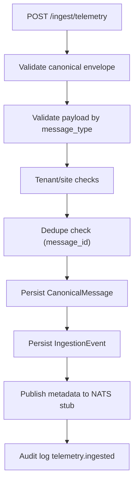

# Realtime, Ingestion, and Alerting

## Live Transport (V1 Phase 6)
Gateway implementation: `apps/api/src/realtime/live.gateway.ts`

Primary protocol:
- Client sends `subscribe` with `{site_id, streams, cursor?}`.
- Server validates tenant/site/RBAC and responds with:
  - `subscribed` (ack + accepted cursor state), or
  - `subscribe.error` (validation/authz failure).
- Server delivers stream updates through `delta` envelopes.

Delta streams:
- `robot_last_state`
- `incidents`
- `missions`

Cursor model:
- Opaque base64url `v=1` cursor (`timestamp + id`).
- Sorting basis:
  - `robot_last_state`: `(updatedAt, robotId)`
  - `incidents`: `(updatedAt, incidentId)`
  - `missions`: `(updatedAt, missionId)`

Catch-up and snapshots:
1. On subscribe, server performs per-stream catch-up from supplied cursor.
2. If cursor is omitted, server sends snapshot batches.
3. Snapshot batch size defaults to `250`.

Delta coalescing:
- In-memory pending buffers by `(tenantId, siteId|all, stream)`.
- Coalescing windows:
  - robots `250ms`
  - incidents `500ms`
  - missions `500ms`
- Multiple updates for same id collapse to latest upsert before flush.

Dual-mode rollout:
- `LIVE_UPDATES_MODE=dual` keeps legacy protocol compatibility.
- Legacy `live.subscribe` clients receive legacy full-array channel payloads.
- Legacy full-array payloads are scoped to legacy subscribers only.
- `LIVE_UPDATES_MODE=delta_only` disables legacy full-array broadcasts.

Legacy channel names still emitted in dual mode:
- `robots.live`
- `incidents.live`
- `missions.live`
- `telemetry.live`
- `alerts.live`
- `live.heartbeat`

## Canonical Ingestion Pipeline
Primary endpoint: `POST /api/ingest/telemetry` in `Phase3Service.ingestTelemetry`.

### Accepted Message Contract
- Strict canonical envelope only.
- `schema_version` support currently restricted to `1`.
- `message_type` restricted to:
  - `robot_state`
  - `robot_event`
  - `task_status`

### Ingest Flow

### Dedupe/Idempotency
Duplicate detection checks both:
- `IngestionEvent(tenantId,dedupeKey=message_id)`
- `CanonicalMessage(tenantId,messageId)`

Duplicate response returns `accepted:0, duplicate:1`.

Phase 4 semantic dedupe windows:
- `robot_event`: `(tenantId,siteId,robotId,dedupe_key)` window `1800s`
- `task_status`: `(tenantId,siteId,taskId,state,updated_at)` encoded as dedupe key, window `86400s`
- Semantic duplicates are processed-as-dropped (audited) and do not create dead letters.

## Adapter Recording and Replay Harness (V1 Phase 5)
Adapter APIs:
- `GET /api/adapters/health`
- `GET /api/adapters/captures`
- `POST /api/adapters/captures/record`
- `POST /api/adapters/replays`
- `GET /api/adapters/replays/:id`

Phase 5 adapter runtime model:
- static adapter registry (explicit local registration)
- polling + streaming runtime contracts
- local filesystem capture repository (`.data/adapter-captures`)
- deterministic replay execution persisted in DB (`AdapterReplayRun`, `AdapterReplayRunEvent`)

Replay execution rule:
- replay transforms raw capture entries to canonical envelopes and calls the same `ingestTelemetry` service method used by `POST /ingest/telemetry`.
- no direct writes to canonical/domain tables are performed by replay bypass paths.

Recording rule:
- recorder writes JSONL entries incrementally (stream-like append)
- manifest is written after collection is complete
- adapter health state is updated on success/failure (`AdapterHealthState`)

Replay deterministic ordering:
- entries sorted by `(timestamp asc, capture_index asc)` when `deterministic_ordering=true`
- optional time-window filtering (`from,to`) is applied before ordering
- per-message replay outcomes persisted as `accepted|duplicate|failed`

## Queue Abstraction and Consumer Tick
Service: `apps/api/src/services/nats-jetstream.service.ts`

Current behavior:
- In-memory queue abstraction storing published messages.
- Connectivity probe to `NATS_URL` host/port every 10s.
- Status surfaced via `/system/pipeline-status`.

Consumer loop: `processIngestionTick()` in `Phase3Service`:
1. Pull up to 200 messages from configured telemetry subject.
2. Cleanup expired `MessageDedupeWindow` rows (`expiresAt < now`).
3. Extract ingestion event IDs.
4. If bus is empty, fallback to queued/published DB events.
5. Process each event via `processIngestionEvent()`.

## Consumer Routing by `message_type`
- `robot_state`
  - Updates `Robot` base record and upserts `RobotLastState`.
  - `RobotLastState` is only mutated by this message type.
  - Phase 4 ordering gate:
    - drop when older than `lastStateTimestamp - 5s`
    - prefer sequence ordering when both candidate + cursor sequences are present
    - fallback to timestamp monotonicity when sequence is absent
  - Accepted writes update cursor fields (`lastStateTimestamp`, `lastStateSequence`, `lastStateMessageId`).
  - Resolves vendor map binding and transforms incoming pose into RobotOps floorplan space.
  - Appends telemetry points from `payload.metrics`.
  - Emits `telemetry.live` (legacy) and `robot_last_state` delta upsert.
  - Does not create incidents.
- `robot_event`
  - Does not mutate `RobotLastState`.
  - Phase 4 requires `payload.dedupe_key`.
  - Uses semantic dedupe window before incident creation.
  - Creates incident and incident timeline event when `create_incident=true`.
  - Emits `incidents.live` (legacy) and `incidents` delta upsert.
- `task_status`
  - Does not mutate `RobotLastState`.
  - Uses semantic dedupe window + task cursor ordering.
  - Updates mission lifecycle fields/timestamps/duration.
  - Appends mission timeline event.
  - Upserts `TaskLastStatus` read-model cursor.
  - Emits `missions.live` (legacy) and `missions` delta upsert.

Failure path:
- Marks ingestion event `failed`.
- Persists payload/error in `TelemetryDeadLetter`.

Drop path (Phase 4 ordering/dedupe):
- Marks ingestion event `processed` (not failed).
- Emits audit entries:
  - `telemetry.robot_state.dropped`
  - `telemetry.robot_event.dropped`
  - `telemetry.task_status.dropped`
- Includes drop reason in audit `diff.after.reason`.

## V1 Phase 3 Pose Mapping and Transform
Applied in `Phase3Service.handleRobotStateMessage()` when `payload.pose` is present.

Resolution order:
1. `vendor_map_id` match on `(tenantId, siteId, source.vendor, vendorMapId)`
2. Else `vendor_map_name` match on `(tenantId, siteId, source.vendor, vendorMapName)`
3. Else compatibility fallback:
   - passthrough when `pose.floorplan_id` is valid for tenant/site
   - otherwise reject processing and dead-letter

Transform math:
- `scale -> rotate(origin) -> translate`
- heading adjustment: `normalize_0_360(heading_in + rotationDegrees)`
- output floorplan uses mapping `robotopsFloorplanId`

Transform-miss behavior:
- audit action emitted: `vendor_site_map.transform_miss`
- ingestion event marked failed
- payload and error persisted to `TelemetryDeadLetter`

## Alerting Engine (Phase 3)
Tick loop: `runAlertEngineTick()`
1. `generateIncidentAlerts()`
2. `generateIntegrationAlerts()`
3. `flushScheduledDeliveries()`
4. `resolveRecoveredAlerts()`

### Rule Matching
Rule matcher validates:
- Minimum severity threshold.
- Category equality when configured.
- Site equality when configured.

### Event + Delivery Creation
`createAlertEventFromRule()`:
1. Verifies active policy and loads ordered steps.
2. Creates `AlertEvent(state=open)`.
3. Creates `AlertDelivery(state=scheduled)` per policy step with `scheduledFor = triggeredAt + delaySeconds`.
4. Writes audit event `alert.triggered`.
5. Emits `alerts.live`.

### Deterministic Delivery Stub
`flushScheduledDeliveries()`:
- Marks due deliveries as `sent` or `failed`.
- Failure is deterministic when target string includes `"fail"`.
- Emits `alerts.live` updates.

### Recovery Handling
`resolveRecoveredAlerts()`:
- Resolves alert events when source incident resolves.
- Resolves integration error alerts when integration status is no longer `error`.
- Cancels still-scheduled deliveries on recovery.

## Rollup Refresh
Method: `refreshRollups()`
- Computes last-hour metrics by site and tenant:
  - missions totals/success
  - incidents open
  - interventions count
  - fleet size
  - uptime percent
- Upserts into hourly rollup tables.

## Pipeline Status Surface
Endpoint: `GET /api/system/pipeline-status`

Response includes:
- NATS connection + stream/subject.
- Ingestion counts (`queued, processed, failed, deadLetters`).
- Rollup freshness (`siteHourlyLatest`, `tenantHourlyLatest`, `freshnessSeconds`).
- Live transport metrics:
  - `mode`
  - `connected_clients`
  - `subscribed_clients`
  - `delta_messages_sent`, `legacy_messages_sent`
  - `delta_bytes_sent`, `legacy_bytes_sent`
  - `last_flush_at`
- Timescale status from infrastructure checks.
