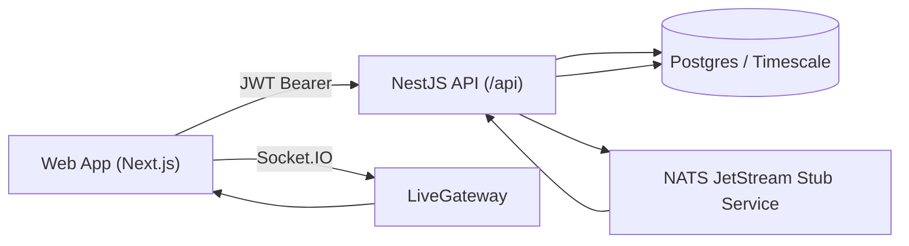

# System Architecture

## Monorepo Layout
- `apps/web`: Next.js 16 application (App Router, NextAuth, TanStack Query, Zustand, Socket.IO client).
- `apps/api`: NestJS API with Prisma, JWT auth guard, permission guard, WebSocket gateway.
- `packages/shared`: shared RBAC catalog, domain types, Zod schemas.
- `scripts`: Playwright/API QA scripts for phase verification.

## Runtime Topology

## Application Boot Sequence (API)
1. `apps/api/src/main.ts` creates Nest app with global `/api` prefix.
2. CORS origins loaded from `CORS_ORIGIN`.
3. Global `ValidationPipe` and `HttpExceptionFilter` enabled.
4. `InfrastructureService.runStartupChecks()` runs:
   - Timescale extension/hypertable/continuous-aggregate visibility checks.
   - NATS connectivity probe status.
5. API listens on `PORT` (default `4000`).

## Core Backend Modules
- `OpsController` + `OpsService`: tenant ops APIs (robots, missions, incidents, telemetry, saved views, integrations, config, audit).
- `Phase3Service`: ingestion (`/ingest/telemetry`), cross-site analytics, alerting engine, RBAC override endpoints, pipeline status.
- `CopilotController` + `CopilotService`: thread creation and message handling with tenant-scoped internal query tools.
- `LiveGateway`: Socket.IO live channels and tenant room fanout.

Read-model pattern (V1 Phase 2):
- `RobotLastState` is the canonical read source for robot live state and pose.
- `SiteSetting` supplies per-site offline timeout and publish cadence defaults.
- Compatibility endpoints (`/robots`, `/robots/:id`) overlay from read model to preserve API stability.

## Frontend Shell Architecture
- Protected dashboard routes under `apps/web/app/(dashboard)`.
- Shared shell:
  - Sidebar navigation (`components/layout/sidebar.tsx`).
  - Top header (`components/layout/top-header.tsx`) with search, notification icon, and profile menu.
- Global filters in Zustand store (`siteId`, `timeRange`) plus URL synchronization.

## Infrastructure Components
- Docker Compose services:
  - Timescale-enabled PostgreSQL (`timescale/timescaledb:2.17.2-pg16`).
  - Redis (`redis:7`) for local dependency parity.
  - NATS (`nats:2.11-alpine`) with JetStream enabled.

## Environment Variables (Current)
- API/runtime:
  - `PORT`, `CORS_ORIGIN`, `DATABASE_URL`, `REDIS_URL`, `JWT_SECRET`
  - `NATS_URL`, `NATS_STREAM`, `NATS_SUBJECT_TELEMETRY`
  - `ROLLUP_JOB_INTERVAL_SECONDS`, `ALERT_ENGINE_INTERVAL_SECONDS`
  - `TIMESCALE_RAW_RETENTION_DAYS`, `TIMESCALE_ROLLUP_RETENTION_DAYS`
- Web/runtime:
  - `NEXTAUTH_URL`, `NEXTAUTH_SECRET`
  - `NEXT_PUBLIC_API_BASE_URL`, `NEXT_PUBLIC_SOCKET_URL`

## Scheduling Loops (Phase 3 Service)
- Ingestion tick: every `1200ms`.
- Rollup refresh tick: every `ROLLUP_JOB_INTERVAL_SECONDS` (min clamp `15s`, default `300s`).
- Alert engine tick: every `ALERT_ENGINE_INTERVAL_SECONDS` (min clamp `5s`, default `15s`).
