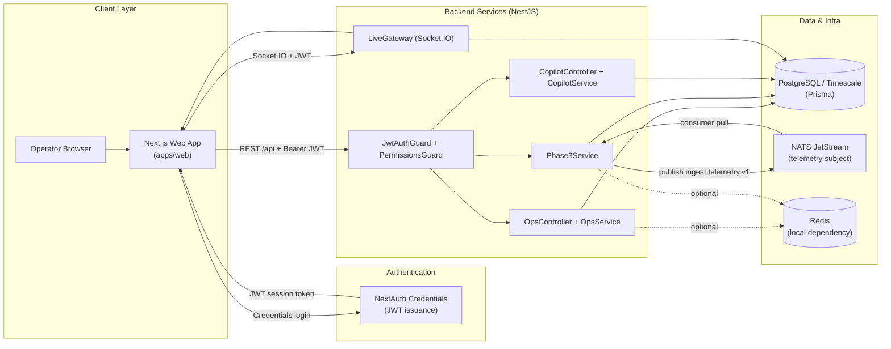
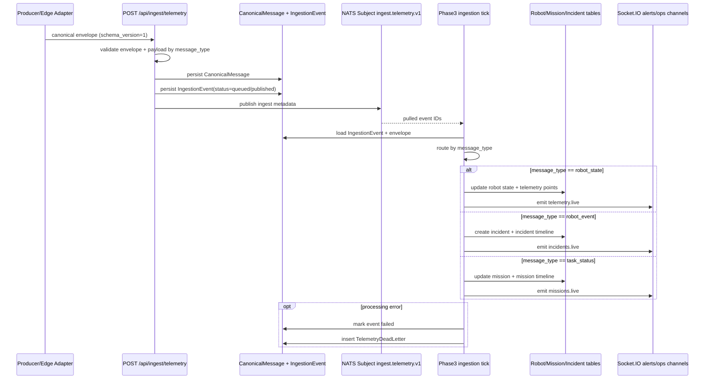
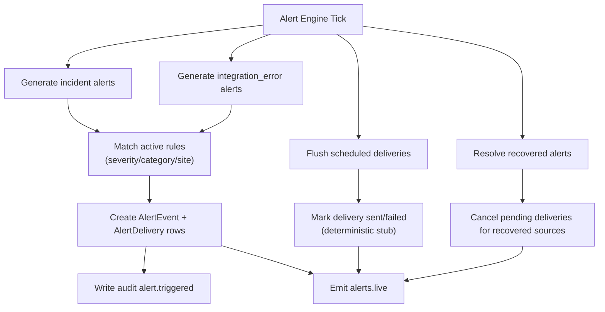

# System Design Diagram

## High-Level Architecture

```mermaid
flowchart LR
  subgraph Client["Client Layer"]
    U["Operator Browser"]
    W["Next.js Web App\n(apps/web)"]
    U --> W
  end

  subgraph Auth["Authentication"]
    NA["NextAuth Credentials\n(JWT issuance)"]
  end

  subgraph API["Backend Services (NestJS)"]
    OC["OpsController + OpsService"]
    P3["Phase3Service"]
    CC["CopilotController + CopilotService"]
    LG["LiveGateway (Socket.IO)"]
    AG["JwtAuthGuard + PermissionsGuard"]
  end

  subgraph Data["Data & Infra"]
    PG[("PostgreSQL / Timescale\n(Prisma)")]
    NATS["NATS JetStream\n(telemetry subject)"]
    REDIS[("Redis\n(local dependency)")]
  end

  W -->|"REST /api + Bearer JWT"| AG
  AG --> OC
  AG --> P3
  AG --> CC

  W -->|"Socket.IO + JWT"| LG
  LG --> W

  W -->|"Credentials login"| NA
  NA -->|"JWT session token"| W

  OC --> PG
  P3 --> PG
  CC --> PG
  LG --> PG

  P3 -->|"publish ingest.telemetry.v1"| NATS
  NATS -->|"consumer pull"| P3

  OC -. optional .-> REDIS
  P3 -. optional .-> REDIS
```

## Canonical Ingestion and Processing Flow

```mermaid
sequenceDiagram
  participant Producer as Producer/Edge Adapter
  participant API as POST /api/ingest/telemetry
  participant DB as CanonicalMessage + IngestionEvent
  participant Bus as NATS Subject ingest.telemetry.v1
  participant Consumer as Phase3 ingestion tick
  participant Domain as Robot/Mission/Incident tables
  participant Live as Socket.IO alerts/ops channels

  Producer->>API: canonical envelope (schema_version=1)
  API->>API: validate envelope + payload by message_type
  API->>DB: persist CanonicalMessage
  API->>DB: persist IngestionEvent(status=queued/published)
  API->>Bus: publish ingest metadata
  Bus-->>Consumer: pulled event IDs
  Consumer->>DB: load IngestionEvent + envelope
  Consumer->>Consumer: route by message_type

  alt message_type == robot_state
    Consumer->>Domain: update robot state + telemetry points
    Consumer->>Live: emit telemetry.live
  else message_type == robot_event
    Consumer->>Domain: create incident + incident timeline
    Consumer->>Live: emit incidents.live
  else message_type == task_status
    Consumer->>Domain: update mission + mission timeline
    Consumer->>Live: emit missions.live
  end

  opt processing error
    Consumer->>DB: mark event failed
    Consumer->>DB: insert TelemetryDeadLetter
  end
```

## Alert Engine Flow (Phase 3)

```mermaid
flowchart TD
  Tick["Alert Engine Tick"] --> I["Generate incident alerts"]
  Tick --> E["Generate integration_error alerts"]
  Tick --> D["Flush scheduled deliveries"]
  Tick --> R["Resolve recovered alerts"]

  I --> Match["Match active rules\n(severity/category/site)"]
  E --> Match
  Match --> Create["Create AlertEvent + AlertDelivery rows"]
  Create --> Audit["Write audit alert.triggered"]
  Create --> Emit["Emit alerts.live"]

  D --> Sent["Mark delivery sent/failed\n(deterministic stub)"]
  Sent --> Emit

  R --> Cancel["Cancel pending deliveries for recovered sources"]
  Cancel --> Emit
```
